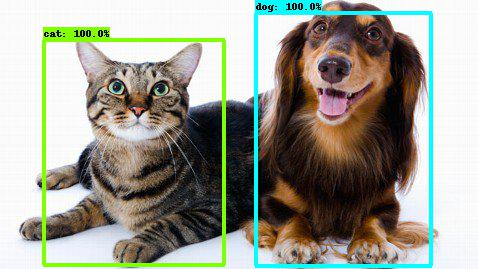
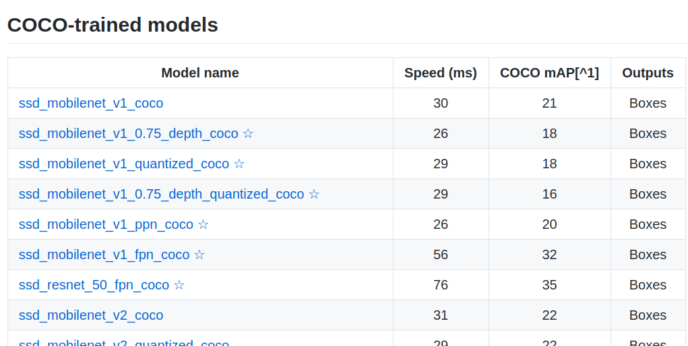
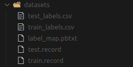
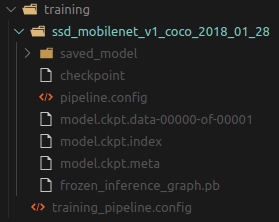
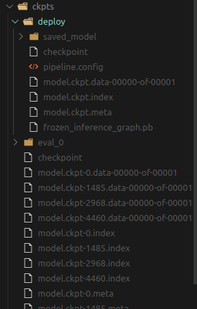

# Implement Tensorflow Object Detection API on Custom Dataset



## Requirements: 
<ul> 
    <li> Anaconda3 </li>
    <li> Python 3.7 </li>
</ul> 

# Usage
``` 
bash main.sh --config_file={PATH_TO_CONFIG_FILE}

```
## Help

``` 
main.sh [--install] [--config_file str] [--env str]

Implement tensorflow (tf-gpu 1.15.0) Object Detection API on custom Dataset.

Requirements: Anaconda3, python 3.7

Args:
    -h|--help           Show this help message
    --install           Install conda env, pip requirements, and tf models API.
    --config_file  str  Path to config file.
                        Default: /home/phatluu/tf_detection_api/config.json
    --env          str  Conda environment name.
                        Default: tf1
```

# Config file

``` 
{
    "image_dir": "PATH_TO_IMAGES_DIRECTORY",
    "anno_dir": "PATH_TO_ANNOTATIONS_DIRECTORY",
    "id":[1,2],
    "name":["cat","dog"],
    "pretrained_model": "ssd_mobilenet_v1_coco",
    "train_ratio":0.75
}
```
## Images and annotations
Search and Download image from google with Python and Selenium

https://towardsdatascience.com/image-scraping-with-python-a96feda8af2d

Label images with labelImg tool

https://github.com/tzutalin/labelImg

## id and name

List of category ID and Names from your custom dataset. Note that Id starts from 1 because ID=0 is for background as default.

## Pretrained models

[Full list of pre-trained models](https://github.com/tensorflow/models/blob/master/research/object_detection/g3doc/detection_model_zoo.md)

## train_ratio
The percentage of training data

# More Details

## Project Files (Original)

``` 
.
├── images
│   ├── 0006fee860.jpg
│   ├── 002bcc5167.jpg
│   ├── 0058af494a.jpg
│   ├── ...
├── annotations
│   ├── 0006fee860.xml
│   ├── 002bcc5167.xml
│   ├── 0058af494a.xml
│   └── ...
├── config.json
├── requirements.txt
├── Scripts
│   ├── main.sh
│   ├── predict.sh
├── src
│   └── tfDetection
│       ├── setup.py
│       ├── tfDetection
│       │   ├── __init__.py
│       │   ├── logging_config.py
│       │   ├── predict.py
│       │   ├── train_setup.py
│       │   └── utils.py

```

## Installation
If the option --install in the bash file main.sh is True, the following steps for enviromental setup will be executed
<ol> 
    <li> Create conda virtual environment, python3.7. Default name: tf1 </li>
    <li> Install tensorlfow-gpu==1.15</li>
    <li> Install required python packages in requirements.txt </li>
    <li> Clone and install object detection API from
    <p> https://github.com/tensorflow/models.git  </p> </li>
    <li> Download and install protobuf from 
    <p> https://github.com/google/protobuf/releases/download/v3.0.0/protoc-3.0.0-linux-x86_64.zip </p> </li>
    <li> Install object detection packages</li>
    
</ol> 

References: 
https://github.com/tensorflow/models/blob/master/research/object_detection/g3doc/installation.md

## Train setup

### Prepare dataset
<ol> 
    <li> label map  </li>
    <li> train/test csv file </li>
    <li> train/test tfrecord files </li>
</ol> 




### Configure training pipeline



References:
1. Setup for custom dataset
    https://github.com/tensorflow/models/blob/master/research/object_detection/g3doc/using_your_own_dataset.md
2. Run the traning job
   https://github.com/tensorflow/models/blob/master/research/object_detection/g3doc/running_locally.md


### Automatically generate train.sh bash file 

``` 
PIPELINE_CONFIG_PATH={AUTO} 
MODEL_DIR={AUTO}
NUM_TRAIN_STEPS=10000 
SAMPLE_1_OF_N_EVAL_EXAMPLES=1 
python object_detection/model_main.py \
	--pipeline_config_path=${PIPELINE_CONFIG_PATH} \
	--model_dir=${MODEL_DIR} \
	--num_train_steps=${NUM_TRAIN_STEPS} \
	--sample_1_of_n_eval_examples=$SAMPLE_1_OF_N_EVAL_EXAMPLES \
	--alsologtostderr \

```

### Train model on custom dataset

